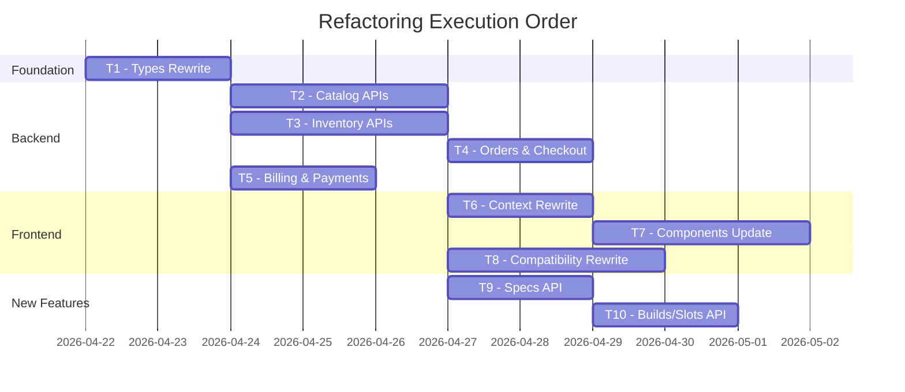

# MD Client — Codebase Dependency Map & Refactoring Plan

> **Generated:** 2026-04-21 | **Schema Version:** Post-refactor (Category model, SpecDefinition, InventoryItem)
> **TL;DR:** The Prisma schema has been heavily redesigned (new spec system, new inventory model, removal of legacy models), but **~90% of the backend API routes, services, frontend types, and contexts still reference the OLD schema**. This document maps every broken dependency, outlines every required change, and provides a parallelizable task plan.

---

## Table of Contents

1. [Schema Change Summary](#schema-change-summary)
2. [Domain: Authentication](#1-domain-authentication)
3. [Domain: Catalog (Products, Brands, Categories)](#2-domain-catalog)
4. [Domain: Specifications & Filters](#3-domain-specifications--filters)
5. [Domain: Inventory](#4-domain-inventory)
6. [Domain: Orders & Checkout](#5-domain-orders--checkout)
7. [Domain: Billing & Invoices](#6-domain-billing--invoices)
8. [Domain: Payments](#7-domain-payments)
9. [Domain: Compatibility & Builds](#8-domain-compatibility--builds)
10. [Domain: Customers](#9-domain-customers)
11. [Domain: Marketing](#10-domain-marketing)
12. [Domain: Audit](#11-domain-audit)
13. [Cross-Cutting Issues](#cross-cutting-issues)
14. [Task Delegation Plan](#task-delegation-plan)

---

## Schema Change Summary

> [!CAUTION]
> These are **breaking changes** that ripple through the entire codebase.

| Change | Old Schema | New Schema | Impact |
|--------|-----------|------------|--------|
| **Category** | `enum Category` on `Product.category` | `Category` model → `SubCategory` model → `Product.subCategoryId` FK | 🔴 **Critical** — every API, type, filter, component that references `product.category` as an enum string is broken |
| **Product Specs** | `ProductSpec` model (key/value pairs on Product) | `SpecDefinition` → `SpecOption` → `VariantSpec` (on ProductVariant) | 🔴 **Critical** — `prisma.productSpec` no longer exists; specs are now on variants, not products |
| **Brand** | `Brand.categories: Category[]` (array of enum) | `Brand` has no `categories` field (just `name`, `slug`, `products[]`) | 🟡 **Medium** — API/types reference `brand.categories` which doesn't exist |
| **Inventory** | `Warehouse` → `WarehouseInventory` → `StockMovement` | `InventoryItem` (on variant, no warehouse) | 🔴 **Critical** — entire inventory API surface references deleted models |
| **Invoice** | `Invoice.currency`, `Invoice.creditNotes[]` | No `currency` field, no `CreditNote` model | 🟡 **Medium** — services/types reference fields not in schema |
| **Payment** | `PaymentTransaction.currency` | No `currency` field on `PaymentTransaction` | 🟡 **Medium** |
| **Order** | `Order.channel` (SalesChannel enum) | No `channel` field on `Order` | 🟡 **Medium** |
| **Order.subtotal** | `Float` | `Decimal` | 🟢 **Low** — API works but types say `number` |
| **ProductVariant.status** | `String` | `VariantStatus` enum (`IN_STOCK`, `OUT_OF_STOCK`, `DISCONTINUED`, `PREORDER`) | 🟡 **Medium** — `'ACTIVE'` used in inventory service doesn't exist |
| **OrderItem.category** | Was typed as `Category` model relation | Now `String` (plain label) | 🟡 **Medium** |

---

## 1. DOMAIN: Authentication

### Data Models
| Model | File | Status |
|-------|------|--------|
| `User` | [schema.prisma](file:///d:/web-dev/web-dev/pc-system/md_client/prisma/schema.prisma#L146-L154) | ✅ Unchanged |

### Backend Layer
| File | Purpose | Status |
|------|---------|--------|
| [app/api/login/route.tsx](file:///d:/web-dev/web-dev/pc-system/md_client/app/api/login/route.tsx) | JWT login | ✅ Works — uses `prisma.user.findUnique` correctly |
| [app/api/register/route.ts](file:///d:/web-dev/web-dev/pc-system/md_client/app/api/register) | User registration | ✅ Likely works |
| [app/api/logout/route.ts](file:///d:/web-dev/web-dev/pc-system/md_client/app/api/logout) | Cookie clear | ✅ |
| [middleware.ts](file:///d:/web-dev/web-dev/pc-system/md_client/middleware.ts) | Admin route protection | ✅ Works — checks JWT, redirects to `/login` |
| [lib/jwt.ts](file:///d:/web-dev/web-dev/pc-system/md_client/lib/jwt.ts) | Token sign/verify | ✅ |

### Frontend Layer
| File | Purpose | Status |
|------|---------|--------|
| [app/(auth)/login/](file:///d:/web-dev/web-dev/pc-system/md_client/app/(auth)/login) | Login page | ✅ |
| [app/(auth)/register/](file:///d:/web-dev/web-dev/pc-system/md_client/app/(auth)/register) | Register page | ✅ |

### Dependency Graph
```
User Model → Login API → JWT lib → Middleware → Admin routes
```

### Issues
- ❌ `types.ts` line 64: `Role` type is `'SUPER_ADMIN' | 'ADMIN' | 'WAREHOUSE_STAFF' | 'FINANCE' | 'USER'` but schema enum only has `ADMIN | USER`
- ⚠️ No role-based authorization beyond the binary admin middleware check

### Required Changes
- [ ] Update `types.ts` `Role` type to match schema: `'ADMIN' | 'USER'`
- [ ] Consider adding role check in middleware (currently just validates token exists)

---

## 2. DOMAIN: Catalog

### Data Models

| Model | Schema Status | Notes |
|-------|-------------|-------|
| `Product` | 🔴 **Changed** | `category: Category` enum removed → replaced with `subCategoryId` FK to `SubCategory` |
| `Product.version` | 🔴 **Removed** | Field existed in types but not in new schema |
| `Product.specs` | 🔴 **Removed** | Was `ProductSpec[]` — model deleted entirely |
| `Product.tags` | 🔴 **Removed** | No `Tag` model in schema |
| `ProductVariant` | 🟡 **Changed** | `status` now typed `VariantStatus` enum instead of `String` |
| `ProductVariant.price` | 🟡 **Changed** | Now `Decimal` not `Float` |
| `ProductMedia` | ✅ Unchanged | |
| `Brand` | 🔴 **Changed** | `categories` field removed; `slug` field added |
| `Category` | 🔴 **New model** | Was an enum, now a full model with `SubCategory[]` |
| `SubCategory` | 🔴 **New model** | Links to products, specs, compatibility scopes |
| `CategoryHierarchy` | 🟡 **Changed** | `categoryId` is now a proper FK, `category` was previously untyped |

### Backend Layer — Issues

#### [app/api/products/route.ts](file:///d:/web-dev/web-dev/pc-system/md_client/app/api/products/route.ts)

| Line | Issue | Severity |
|------|-------|----------|
| 6-8 | `CategoryEnum` Zod enum hardcoded with old enum values | 🔴 |
| 19 | `category: CategoryEnum` in create schema — field doesn't exist on Product | 🔴 |
| 46 | `specs: { some: { value: ... } }` — `ProductSpec` model deleted | 🔴 |
| 60 | `MINIMAL_SELECT` references `category: true` — field doesn't exist | 🔴 |
| 65 | References `warehouseInventories` — relation doesn't exist on variant | 🔴 |
| 73-75 | `FULL_SELECT` references `specs`, `category`, `warehouseInventories` | 🔴 |
| 97-101 | `POST_INCLUDE` references `{ specs: true }` — model deleted | 🔴 |
| 170 | Filter by `specs: { some: ... }` — model deleted | 🔴 |
| 182-209 | `resolveFilterOptions` calls `prisma.productSpec.findMany` — table doesn't exist | 🔴 |
| 348-361 | Product create uses `category`, `specs: { create: ... }` — all broken | 🔴 |
| 367-402 | References `warehouse`, `warehouseInventory`, `stockMovement` — all deleted | 🔴 |

#### [app/api/products/[id]/route.ts](file:///d:/web-dev/web-dev/pc-system/md_client/app/api/products/%5Bid%5D/route.ts)

| Line | Issue | Severity |
|------|-------|----------|
| 38 | `include: { warehouseInventories: true }` on variants | 🔴 |
| 72-73 | `tx.productSpec.deleteMany` / `tx.productSpec.createMany` — model deleted | 🔴 |
| 97-103 | `warehouse`, `warehouseInventory` references — models deleted | 🔴 |

#### [app/api/brands/route.ts](file:///d:/web-dev/web-dev/pc-system/md_client/app/api/brands/route.ts)

| Line | Issue | Severity |
|------|-------|----------|
| 5-8 | `CategoryEnum` hardcoded — no longer needed | 🟡 |
| 12 | `categories: z.array(CategoryEnum)` — field doesn't exist on Brand | 🔴 |
| 29 | `select: { categories: true }` — field doesn't exist | 🔴 |
| 59 | `data: { categories: ... }` — field doesn't exist | 🔴 |

#### [app/api/categories/route.ts](file:///d:/web-dev/web-dev/pc-system/md_client/app/api/categories/route.ts)

| Line | Issue | Severity |
|------|-------|----------|
| 2 | `import { Category } from "@/generated/prisma/client"` — `Category` is no longer an enum, it's a model | 🔴 |
| 7 | `Object.values(Category)` — doesn't work on a model class | 🔴 |

### Frontend Layer — Issues

#### [types.ts](file:///d:/web-dev/web-dev/pc-system/md_client/types.ts)

| Line | Issue | Severity |
|------|-------|----------|
| 5-18 | `enum Category` — doesn't match schema (schema has model, not enum) | 🔴 |
| 76-81 | `ProductSpec` interface — model deleted | 🔴 |
| 83-86 | `Tag` interface — no model in schema | 🔴 |
| 108 | `warehouseInventories?: WarehouseInventory[]` — model deleted | 🔴 |
| 117 | `category: Category` — field doesn't exist | 🔴 |
| 121 | `version: number` — field doesn't exist | 🔴 |
| 129 | `specs: ProductSpec[]` — model deleted | 🔴 |
| 132 | `tags: Tag[]` — model deleted | 🔴 |
| 145-182 | `specsToFlat()`, `flatToSpecs()` — operate on deleted `ProductSpec` model | 🔴 |
| 196 | `Brand.categories: Category[]` — field doesn't exist | 🔴 |
| 209 | `CategoryNode.category?: Category` — wrong type | 🔴 |
| 278-301 | `Warehouse`, `WarehouseInventory` interfaces — models deleted | 🔴 |
| 303-319 | `StockMovement` interface — model deleted | 🔴 |
| 388 | `OrderItem.category: Category` — now a string, not enum | 🟡 |
| 406 | `Order.channel: SalesChannel` — field doesn't exist | 🔴 |
| 502 | `BillingProfile.currency: Currency` — field doesn't exist | 🔴 |
| 544 | `Invoice.currency: Currency` — field doesn't exist | 🔴 |
| 604 | `PaymentTransaction.currency: Currency` — field doesn't exist | 🔴 |

#### [context/AdminContext.tsx](file:///d:/web-dev/web-dev/pc-system/md_client/context/AdminContext.tsx)

| Line | Issue | Severity |
|------|-------|----------|
| 8-12 | Imports `Category`, `CategoryNode`, `Brand`, `CategorySchema`, `WarehouseInventory`, `StockMovement`, `Warehouse` — types broken | 🔴 |
| 20-28 | Context type references `Warehouse[]`, `WarehouseInventory[]`, `StockMovement[]` | 🔴 |
| 60-65 | `CategorySchema`, `CategoryFilterConfig` — these depend on Category enum | 🔴 |
| 166 | `useState<WarehouseInventory[]>` — type broken | 🔴 |
| 223-243 | `refreshInventory`, `refreshWarehouses`, `refreshStockMovements` — call deleted API endpoints | 🔴 |

#### [context/ShopContext.tsx](file:///d:/web-dev/web-dev/pc-system/md_client/context/ShopContext.tsx)

| Line | Issue | Severity |
|------|-------|----------|
| 9 | Imports `Product`, `CategoryNode`, `Brand`, `CategoryFilterConfig` — types broken | 🔴 |
| 244 | `prev[0].category !== product.category` — `category` field doesn't exist | 🔴 |
| 269-278 | `placeOrder` sends `category: item.category` — field doesn't exist | 🔴 |

#### [services/compatibility.ts](file:///d:/web-dev/web-dev/pc-system/md_client/services/compatibility.ts)

| Line | Issue | Severity |
|------|-------|----------|
| 1 | Imports `CartItem`, `Category`, `specsToFlat` — all broken | 🔴 |
| 262-285 | `validateBuild` filters by `Category.PROCESSOR`, `Category.MOTHERBOARD`, etc. and calls `specsToFlat(item.specs)` — both broken | 🔴 |

### Dependency Graph
```
Product Model (BROKEN) → Products API (BROKEN) → AdminContext (BROKEN) → Admin Pages
                       → ShopContext (BROKEN) → Storefront Pages
                       → Compatibility Service (BROKEN) → BuildContext → Build Pages
Brand Model (BROKEN)   → Brands API (BROKEN) → AdminContext → Admin Pages
Category Model (NEW)   → Categories API (BROKEN) → ShopContext → Sidebar/Filters
SubCategory (NEW)      → Not yet integrated anywhere
SpecDefinition (NEW)   → Not yet integrated (was ProductSpec)
```

### Required Changes

**Backend:**
- [ ] **Rewrite** `app/api/products/route.ts` — replace `category` with `subCategoryId`, replace `ProductSpec` with `VariantSpec`, remove `warehouseInventory`/`stockMovement` references, replace with `InventoryItem`
- [ ] **Rewrite** `app/api/products/[id]/route.ts` — same changes
- [ ] **Rewrite** `app/api/brands/route.ts` — remove `categories` field handling
- [ ] **Rewrite** `app/api/categories/route.ts` — query `Category` model instead of enum
- [ ] **Create** new APIs for `SubCategory`, `SpecDefinition`, `SpecOption` CRUD
- [ ] **Update** `app/api/categories/schemas/route.ts` — replace `CategorySchema` with `SpecDefinition` queries
- [ ] **Update** `app/api/categories/filters/route.ts` — derive filters from `SpecDefinition.isFilterable`

**Frontend:**
- [ ] **Rewrite** `types.ts` — align all interfaces with new schema
- [ ] **Rewrite** `context/AdminContext.tsx` — replace all deleted model references
- [ ] **Rewrite** `context/ShopContext.tsx` — replace `category` references
- [ ] **Rewrite** `services/compatibility.ts` — use new spec system (`VariantSpec` → `SpecDefinition`)
- [ ] **Update** `data/categoryTree.ts`, `data/filterConfig.ts` — may be obsolete if data is now DB-driven
- [ ] **Update** all components referencing `product.category`, `product.specs`, `brand.categories`

---

## 3. DOMAIN: Specifications & Filters

### Data Models (NEW)
| Model | Purpose |
|-------|---------|
| `SpecDefinition` | Defines a spec (e.g., "Socket") per SubCategory |
| `SpecOption` | Possible values for a spec (e.g., "LGA1700") |
| `VariantSpec` | Assigns spec values to a ProductVariant |
| `SpecOptionDependency` | Parent-child option relationships |

### Backend Layer
- ❌ **No API routes exist** for `SpecDefinition`, `SpecOption`, or `VariantSpec` CRUD
- ❌ The old `CategorySchema` / `AttributeDefinition` API endpoints still target deleted models
- ❌ Filter resolution (`resolveFilterOptions`) uses `prisma.productSpec.findMany` — table deleted

### Frontend Layer
- ❌ `types.ts` `CategorySchema` / `AttributeDefinition` interfaces model the old system
- ❌ `data/filterConfig.ts` has hardcoded filter configurations by Category enum
- ❌ Admin schema editor (`updateSchema`) still sends old format

### Required Changes
- [ ] **Create** `app/api/specs/route.ts` — CRUD for SpecDefinition + SpecOption
- [ ] **Create** `app/api/specs/[id]/route.ts` — update/delete spec definitions
- [ ] **Rewrite** product filter resolution to query `SpecDefinition` where `isFilterable=true` and aggregate `VariantSpec` values
- [ ] **Replace** `CategorySchema` concept with dynamic spec definitions from DB
- [ ] **Update** `data/filterConfig.ts` → either delete (if fully DB-driven) or transform

---

## 4. DOMAIN: Inventory

### Data Models

| Old Model | New Model | Status |
|-----------|----------|--------|
| `Warehouse` | ❌ **Deleted** | Not in schema |
| `WarehouseInventory` | `InventoryItem` | Completely different shape |
| `StockMovement` | ❌ **Deleted** | Not in schema |
| — | `Reservation` | **New** — order-linked inventory reservations |

**Key differences in `InventoryItem` vs old `WarehouseInventory`:**
- No `warehouseId` — not warehouse-specific anymore
- Has `trackingType` (SERIALIZED / BULK)
- Has `serialNumber`, `partNumber`, `batchNumber`
- Has `status` (IN_STOCK, RESERVED, SOLD, DAMAGED, RMA, IN_TRANSIT, RETURNED)
- Has `quantityOnHand`, `quantityReserved` instead of `quantity`, `reserved`
- No `reorderLevel`, `location`, `lastUpdated` fields

### Backend Layer — Issues

| File | Issue | Severity |
|------|-------|----------|
| [app/api/inventory/route.ts](file:///d:/web-dev/web-dev/pc-system/md_client/app/api/inventory/route.ts) | References `warehouseInventory`, `reorderLevel`, `costPrice`, `location`, `lastUpdated`, `warehouseId` — all broken | 🔴 |
| [app/api/inventory/[id]/movements/route.ts](file:///d:/web-dev/web-dev/pc-system/md_client/app/api/inventory/%5Bid%5D/movements) | References `stockMovement`, `warehouseInventory` — tables deleted | 🔴 |
| [app/api/inventory/movements/route.ts](file:///d:/web-dev/web-dev/pc-system/md_client/app/api/inventory/movements) | `prisma.stockMovement.findMany` — table deleted | 🔴 |
| [app/api/inventory/transfer/route.ts](file:///d:/web-dev/web-dev/pc-system/md_client/app/api/inventory/transfer) | References warehouses, warehouse IDs — concept removed | 🔴 |
| [app/api/inventory/purchase-orders/](file:///d:/web-dev/web-dev/pc-system/md_client/app/api/inventory/purchase-orders) | References suppliers, purchase orders — models not in schema | 🔴 |
| [app/api/warehouses/route.ts](file:///d:/web-dev/web-dev/pc-system/md_client/app/api/warehouses/route.ts) | `prisma.warehouse.findMany` — table deleted | 🔴 |
| [services/inventoryService.ts](file:///d:/web-dev/web-dev/pc-system/md_client/services/inventoryService.ts) | All functions reference `warehouseInventory`, `stockMovement` — models deleted. Also sets variant status to `'ACTIVE'` (L194) which isn't a valid `VariantStatus` enum value | 🔴 |

### Frontend Layer — Issues

| File | Issue |
|------|-------|
| `types.ts` L278-319 | `Warehouse`, `WarehouseInventory`, `StockMovement` interfaces — models deleted |
| `types.ts` L325-358 | `Supplier`, `PurchaseOrder`, `PurchaseOrderItem` — models not in schema |
| `context/AdminContext.tsx` | ~15 references to warehouse/stockMovement/supplier/purchaseOrder state + actions |

### Required Changes

**Backend:**
- [ ] **Rewrite** `app/api/inventory/route.ts` — query `InventoryItem` instead of `WarehouseInventory`
- [ ] **Delete or rewrite** `app/api/inventory/transfer/` — warehouses removed
- [ ] **Delete or rewrite** `app/api/inventory/movements/` — StockMovement removed
- [ ] **Delete** `app/api/warehouses/route.ts` — model doesn't exist
- [ ] **Delete or rewrite** `app/api/inventory/purchase-orders/` — model not in schema
- [ ] **Delete** `app/api/suppliers/` — model not in schema
- [ ] **Rewrite** `services/inventoryService.ts` — use `InventoryItem` + `Reservation` models
- [ ] **Create** reservation management API (using `Reservation` model)
- [ ] Fix variant status values: replace `'ACTIVE'` with `'IN_STOCK'`

**Frontend:**
- [ ] Remove `Warehouse`, `WarehouseInventory`, `StockMovement`, `Supplier`, `PurchaseOrder` types
- [ ] Create `InventoryItem`, `Reservation` types matching schema
- [ ] **Rewrite** admin inventory tab components

---

## 5. DOMAIN: Orders & Checkout

### Data Models
| Model | Status | Notes |
|-------|--------|-------|
| `Order` | 🟡 **Changed** | `channel` field removed; `subtotal`/`gstAmount`/`taxAmount`/`discountAmount` now `Decimal`; `deletedAt` added |
| `OrderItem` | 🟡 **Changed** | `category` now `String` (was `Category` enum); `inventoryItemId` FK added |
| `OrderLog` | ✅ Unchanged | |
| `ShipmentTracking` | ✅ Unchanged | |

### Backend Layer — Issues

| File | Issue | Severity |
|------|-------|----------|
| [app/api/orders/route.ts](file:///d:/web-dev/web-dev/pc-system/md_client/app/api/orders/route.ts) L9-12 | `CategoryEnum` hardcoded for order items — should be plain string now | 🟡 |
| L18 | `SalesChannelEnum` — `channel` field doesn't exist on Order | 🔴 |
| L19 | `PaymentMethodEnum` includes `CARD`, `CASH`, `WALLET` — schema only has `RAZORPAY`, `UPI`, `BANK_TRANSFER` | 🔴 |
| L25 | `orderItemSchema.category = CategoryEnum` — category is now a plain string | 🟡 |
| L34 | `createOrderSchema.channel` — field doesn't exist | 🔴 |
| L67 | `where.channel = channel` — field doesn't exist | 🔴 |
| L84 | `select: { channel: true }` — field doesn't exist | 🔴 |
| L165 | `order.create({ channel: data.channel })` — field doesn't exist | 🔴 |
| L208-212 | `reserveInventory` uses old `warehouseInventory` model internally | 🔴 |
| [app/api/orders/[id]/route.ts](file:///d:/web-dev/web-dev/pc-system/md_client/app/api/orders/%5Bid%5D) | Status transition logic likely references old inventory functions | 🔴 |
| [app/actions/checkout.ts](file:///d:/web-dev/web-dev/pc-system/md_client/app/actions/checkout.ts) L3 | Imports `Category` from prisma enums — now a model not enum | 🔴 |
| L6 | Imports `calculateOrderFinancials` from `@/lib/gst` — file is `gst.ts` (165 bytes, likely incomplete) | 🔴 |
| L44 | `include: { warehouseInventories: true }` on variants | 🔴 |
| L66 | `variant.warehouseInventories[0]` — relation deleted | 🔴 |
| L72 | `variant.price` is now `Decimal`, arithmetic may fail | 🟡 |
| L78 | `product.category` — field doesn't exist | 🔴 |
| L93-166 | All `warehouseInventory`, `stockMovement` refs — models deleted | 🔴 |

### Frontend Layer — Issues

| File | Issue |
|------|-------|
| `types.ts` L388 | `OrderItem.category: Category` — should be `string` |
| `types.ts` L406 | `Order.channel: SalesChannel` — field removed |
| `context/ShopContext.tsx` L273 | `category: item.category` in placeOrder — field doesn't exist on product |

### Required Changes

**Backend:**
- [ ] **Rewrite** `app/api/orders/route.ts` — remove `channel`, fix `PaymentMethodEnum` to match schema (`RAZORPAY | UPI | BANK_TRANSFER`), remove `CategoryEnum` from order items
- [ ] **Rewrite** `app/actions/checkout.ts` — replace `warehouseInventory` with `InventoryItem`, fix `product.category` → `product.subCategoryId`, fix `gst` import
- [ ] **Update** inventory reservation calls to use new `InventoryItem` + `Reservation` pattern

**Frontend:**
- [ ] Fix `OrderItem.category` type to `string`
- [ ] Remove `Order.channel` from types
- [ ] Fix `placeOrder` to not send `category`

---

## 6. DOMAIN: Billing & Invoices

### Data Models
| Model | Status | Notes |
|-------|--------|-------|
| `Invoice` | 🟡 **Changed** | `currency` field removed; `subtotal`/financial fields now `Decimal` |
| `InvoiceLineItem` | 🟡 **Changed** | `unitPrice` now `Decimal` |
| `InvoiceAuditEvent` | ✅ Unchanged | |
| `InvoiceSequence` | ✅ Unchanged | |
| `BillingProfile` | 🟡 **Changed** | `currency` field removed |
| `CreditNote` | 🔴 **Deleted** | Not in schema — was used by `invoiceService.ts` |
| `CreditNoteLineItem` | 🔴 **Deleted** | Not in schema |

### Backend Layer — Issues

| File | Issue | Severity |
|------|-------|----------|
| [app/api/invoices/route.ts](file:///d:/web-dev/web-dev/pc-system/md_client/app/api/invoices/route.ts) L6 | `CurrencyEnum` — no currency field | 🔴 |
| L56 | `select: { currency: true }` — field doesn't exist | 🔴 |
| L131 | `currency: data.currency` in create — field doesn't exist | 🔴 |
| [app/api/invoices/[id]/route.ts](file:///d:/web-dev/web-dev/pc-system/md_client/app/api/invoices/%5Bid%5D) L60, L129, L199 | `creditNotes` includes — model deleted | 🔴 |
| [app/api/credit-notes/route.ts](file:///d:/web-dev/web-dev/pc-system/md_client/app/api/credit-notes/route.ts) | `prisma.creditNote` — table deleted | 🔴 |
| [services/invoiceService.ts](file:///d:/web-dev/web-dev/pc-system/md_client/services/invoiceService.ts) L137 | `currency: 'INR'` in create — field doesn't exist | 🔴 |
| L232 | `tx.creditNote.create()` — model deleted | 🔴 |
| [app/api/billing-profile/route.ts](file:///d:/web-dev/web-dev/pc-system/md_client/app/api/billing-profile/route.ts) | May reference `currency` — field removed | 🟡 |

### Required Changes

**Backend:**
- [ ] Remove `currency` from invoice creation/queries
- [ ] Remove `creditNotes` includes from invoice [id] route
- [ ] **Delete** `app/api/credit-notes/route.ts` or implement credit notes as CREDIT_NOTE type invoices using `InvoiceType` enum
- [ ] **Rewrite** `services/invoiceService.ts` `createCreditNote()` — use `Invoice` with `type: 'CREDIT_NOTE'` instead of a separate model
- [ ] Remove `currency` from billing profile API

**Frontend:**
- [ ] Remove `Currency` type and all `currency` fields from `Invoice`, `BillingProfile`, `PaymentTransaction` types
- [ ] Remove `CreditNote`, `CreditNoteLineItem` types (or repurpose as CREDIT_NOTE invoices)

---

## 7. DOMAIN: Payments

### Data Models
| Model | Status | Notes |
|-------|--------|-------|
| `PaymentTransaction` | 🟡 **Changed** | `currency` removed; `method` now `PaymentMethodType` enum (`RAZORPAY | UPI | BANK_TRANSFER`); `amount` now `Decimal` |
| `PaymentProof` | ✅ New model | Exists in schema but no API |

### Backend Layer — Issues

| File | Issue | Severity |
|------|-------|----------|
| [app/api/payments/route.ts](file:///d:/web-dev/web-dev/pc-system/md_client/app/api/payments/route.ts) L6 | `PaymentMethodEnum` includes `CARD`, `CASH`, `WALLET` — not in schema | 🔴 |
| L8 | `CurrencyEnum` — no currency field | 🔴 |
| L14 | `currency: CurrencyEnum` — field doesn't exist | 🔴 |
| L70 | `currency: data.currency as any` — field doesn't exist | 🔴 |
| [services/paymentService.ts](file:///d:/web-dev/web-dev/pc-system/md_client/services/paymentService.ts) L11 | Imports `Currency` from prisma — type doesn't exist | 🔴 |
| L23 | `currency?: Currency` in interface | 🔴 |
| L46 | `currency: input.currency ?? 'INR'` — field doesn't exist | 🔴 |
| L84 | `sum + t.amount` — amount is `Decimal`, not `number` | 🟡 |
| L131 | `currency: original.currency` — field doesn't exist | 🔴 |

### Required Changes
- [ ] Remove `currency` from `CreatePaymentInput`, payment service, and API
- [ ] Fix `PaymentMethodEnum` to `RAZORPAY | UPI | BANK_TRANSFER`
- [ ] Handle `Decimal` arithmetic in reconciliation
- [ ] **Create** API for `PaymentProof` (exists in schema, no API)

---

## 8. DOMAIN: Compatibility & Builds

### Data Models

| Model | Status |
|-------|--------|
| `Build` | ✅ New |
| `BuildItem` | ✅ New — links to `PartSlot` |
| `PartSlot` | ✅ New |
| `SubCategorySlot` | ✅ New |
| `SlotConstraint` | ✅ New |
| `CompatibilityScope` | ✅ New |
| `CompatibilityRule` | ✅ New |
| `CompatibilityCheck` | ✅ New |
| `BuildCompatibilityResult` | ✅ New |
| `DerivedSpec` | ✅ New |
| `VariantCompatibilityCache` | ✅ New |
| `BuildGuide` | ✅ Exists |
| `BuildGuideItem` | ✅ Exists |

### Backend Layer — Issues

| Issue | Severity |
|-------|----------|
| `services/compatibility.ts` is a **client-side rule engine** that uses `Category` enum and `ProductSpec` — both deleted | 🔴 |
| No server-side API exists for the new compatibility models (`CompatibilityRule`, `CompatibilityScope`, `CompatibilityCheck`, `Build`, `BuildItem`, `PartSlot`) | 🔴 |
| [app/api/build-guides/route.ts](file:///d:/web-dev/web-dev/pc-system/md_client/app/api/build-guides/route.ts) — likely still works if it only uses `BuildGuide` + `BuildGuideItem` | ✅ |

### Frontend Layer — Issues

| File | Issue |
|------|-------|
| `context/BuildContext.tsx` L1-9 | Imports `CartItem` (uses `Category`, `ProductSpec`) — type broken |
| `context/BuildContext.tsx` L45 | `validateBuild(cart)` — compatibility service broken |
| `services/compatibility.ts` | Filters items by `Category.PROCESSOR`, etc. and reads `specsToFlat(item.specs)` — both concepts removed |

### Required Changes

**Backend (new APIs):**
- [ ] **Create** `app/api/builds/route.ts` — CRUD for `Build` + `BuildItem`
- [ ] **Create** `app/api/compatibility/route.ts` — server-side compatibility check using `CompatibilityRule` + `CompatibilityScope`
- [ ] **Create** `app/api/part-slots/route.ts` — manage part slots + constraints

**Frontend:**
- [ ] **Rewrite** `services/compatibility.ts` — replace Category enum matching with SubCategory-based matching via `SubCategorySlot`, read specs from `VariantSpec` instead of `ProductSpec`
- [ ] **Update** `BuildContext` to use rewritten compatibility service

---

## 9. DOMAIN: Customers

### Data Models
| Model | Status |
|-------|--------|
| `Customer` | ✅ Unchanged |

### Backend/Frontend
- ✅ [app/api/customers/route.ts](file:///d:/web-dev/web-dev/pc-system/md_client/app/api/customers/route.ts) — works correctly
- ✅ `types.ts` `Customer` interface matches schema

### Issues
- None critical

---

## 10. DOMAIN: Marketing

### Data Models
- ❌ **No marketing models in schema** — APIs exist (`/api/marketing/*`) but there are no corresponding Prisma models

### Backend Layer
| File | Issue | Severity |
|------|-------|----------|
| `app/api/marketing/stats/` | No backing model | 🟡 |
| `app/api/marketing/campaigns/` | No backing model | 🟡 |
| `app/api/marketing/leads/` | No backing model | 🟡 |
| `app/api/marketing/logs/` | No backing model | 🟡 |
| `app/api/marketing/all-contacts/` | No backing model | 🟡 |
| `app/api/marketing/cron/` | No backing model | 🟡 |
| `app/api/marketing/events/` | No backing model | 🟡 |

### Required Changes
- [ ] Either add marketing models to schema or remove/mock these endpoints
- [ ] `AdminContext` has marketing state/refresh — will need to be updated accordingly

---

## 11. DOMAIN: Audit

### Data Models
| Model | Status |
|-------|--------|
| `AuditLog` | ✅ Unchanged |

### Issues
- No critical issues. API at `app/api/audit-logs/route.ts` likely works.

---

## Cross-Cutting Issues

### 1. `types.ts` is a Single Point of Failure
Almost every component and context imports from `types.ts`. The file has **~50+ broken references**. It must be rewritten before any frontend work can proceed.

### 2. Decimal vs Number
Schema uses `Decimal` for prices/amounts. Frontend types use `number`. Prisma returns `Decimal` objects which don't auto-serialize to numbers in JSON. Need to ensure `.toNumber()` or serialization handling.

### 3. `app/actions/checkout.ts` Duplicates Order Logic
The server action `processCheckout` duplicates much of the `POST /api/orders` logic, including its own inventory reservation (using the deleted `warehouseInventory` model). This is a maintenance hazard.

### 4. `data/filterConfig.ts` and `data/categoryTree.ts` are Hardcoded
These files contain static category-to-filter mappings using the old `Category` enum. The new schema stores this configuration as data in `SpecDefinition` (with `isFilterable`, `filterGroup`, `filterOrder`). These files should be deleted or replaced with dynamic API calls.

### 5. `services/billingUtils.ts` 
May contain references to old types — needs verification.

---

## Task Delegation Plan

### Priority Order: Schema-First, Types-Second, APIs-Third, Frontend-Last



---

### T1: Foundation — Types & Shared Modules

| | |
|---|---|
| **Task** | Rewrite `types.ts` and shared utilities |
| **Scope** | `types.ts`, `lib/gst.ts`, `lib/utils.ts` |
| **Files Modified** | [types.ts](file:///d:/web-dev/web-dev/pc-system/md_client/types.ts) |
| **Dependencies** | None — must be done first |
| **Risk** | 🟡 Medium — touching every import |
| **Parallelizable** | No — everything depends on this |

**Specific work:**
1. Remove: `Category` enum, `ProductSpec`, `Tag`, `Warehouse`, `WarehouseInventory`, `StockMovement`, `Supplier`, `PurchaseOrder`, `CreditNote`, `CreditNoteLineItem`
2. Add: `SubCategory`, `SpecDefinition`, `SpecOption`, `VariantSpec`, `InventoryItem`, `Reservation`, `PartSlot`, `SubCategorySlot`
3. Fix: `Product` (remove `category`/`specs`/`tags`/`version`, add `subCategoryId`), `Brand` (remove `categories`, add `slug`), `ProductVariant` (status → `VariantStatus`, price → `number` serialized from Decimal), `OrderItem` (category → `string`), `Order` (remove `channel`), `Invoice`/`BillingProfile`/`PaymentTransaction` (remove `currency`)
4. Update: `specsToFlat()` / `flatToSpecs()` to work with `VariantSpec[]` or delete

---

### T2: Backend — Catalog APIs (Products, Brands, Categories)

| | |
|---|---|
| **Task** | Rewrite all catalog-related API routes |
| **Scope** | `app/api/products/`, `app/api/brands/`, `app/api/categories/` |
| **Files Modified** | 6 files |
| **Dependencies** | T1 (types) |
| **Risk** | 🔴 High — core CRUD |
| **Parallelizable** | Yes — with T3, T5 |

**Specific work:**
1. `products/route.ts` GET: Replace `category` filter with `subCategoryId`, replace `specs` queries with `variants.variantSpecs` joins, replace `warehouseInventories` with `inventoryItems`, rebuild filter options from `SpecDefinition`
2. `products/route.ts` POST: Accept `subCategoryId` instead of `category`, create `VariantSpec` entries instead of `ProductSpec`, create `InventoryItem` instead of `WarehouseInventory`
3. `products/[id]/route.ts` PUT: Same changes + handle spec updates via `VariantSpec`
4. `brands/route.ts`: Remove `categories` from schema/select/create
5. `categories/route.ts`: Query `Category` model via `prisma.category.findMany()`, return with subcategories

---

### T3: Backend — Inventory APIs

| | |
|---|---|
| **Task** | Rewrite inventory system to use `InventoryItem` + `Reservation` |
| **Scope** | `app/api/inventory/`, `services/inventoryService.ts`, `app/api/warehouses/` |
| **Files Modified** | ~8 files |
| **Dependencies** | T1 (types) |
| **Risk** | 🔴 High — financial accuracy |
| **Parallelizable** | Yes — with T2, T5 |

**Specific work:**
1. **Rewrite** `inventoryService.ts` — use `InventoryItem` instead of `WarehouseInventory`, use `Reservation` model for order reservations, fix variant status values (`IN_STOCK` not `ACTIVE`)
2. **Rewrite** `app/api/inventory/route.ts` — query `InventoryItem` model
3. **Delete** `app/api/warehouses/route.ts`
4. **Delete or simplify** `app/api/inventory/transfer/route.ts`
5. **Delete** `app/api/inventory/movements/route.ts`
6. **Delete** `app/api/suppliers/` and `app/api/inventory/purchase-orders/`
7. **Create** reservation API endpoint

---

### T4: Backend — Orders & Checkout

| | |
|---|---|
| **Task** | Fix order creation and checkout flows |
| **Scope** | `app/api/orders/`, `app/actions/checkout.ts` |
| **Files Modified** | 3 files |
| **Dependencies** | T2, T3 (needs catalog + inventory fixes) |
| **Risk** | 🔴 High — revenue path |
| **Parallelizable** | No — depends on T2+T3 |

**Specific work:**
1. Remove `channel` / `SalesChannelEnum` from order creation
2. Fix `PaymentMethodEnum` to match schema
3. Replace `CategoryEnum` with plain string for `orderItem.category`
4. Update `checkout.ts` — replace `warehouseInventory` with `InventoryItem`, fix `product.category` → derive from `SubCategory`, use proper `gst` import
5. Consolidate checkout logic (remove duplication between server action and API route)

---

### T5: Backend — Billing & Payments

| | |
|---|---|
| **Task** | Fix invoice and payment APIs |
| **Scope** | `app/api/invoices/`, `app/api/payments/`, `app/api/credit-notes/`, `app/api/billing-profile/`, `services/invoiceService.ts`, `services/paymentService.ts` |
| **Files Modified** | ~8 files |
| **Dependencies** | T1 (types) |
| **Risk** | 🟡 Medium |
| **Parallelizable** | Yes — with T2, T3 |

**Specific work:**
1. Remove `currency` from invoice create/select/types
2. Remove `currency` from payment create/reconciliation
3. Fix `PaymentMethodType` import in paymentService
4. Rewrite `createCreditNote` to use `Invoice` with `type: CREDIT_NOTE`
5. Remove `creditNotes` relation includes from invoice [id] queries
6. Delete `app/api/credit-notes/route.ts` (or rewrite to use CREDIT_NOTE invoice type)
7. Handle `Decimal` arithmetic (`.toNumber()` conversions)
8. Create `PaymentProof` API endpoint

---

### T6: Frontend — Context & State Rewrite

| | |
|---|---|
| **Task** | Rewrite all React contexts |
| **Scope** | `context/AdminContext.tsx`, `context/ShopContext.tsx`, `context/BuildContext.tsx` |
| **Files Modified** | 3 files |
| **Dependencies** | T2, T3 (APIs must exist for contexts to call) |
| **Risk** | 🟡 Medium |
| **Parallelizable** | No — depends on backend tasks |

**Specific work:**
1. `AdminContext`: Remove warehouse/supplier/purchaseOrder state + actions, add InventoryItem state, fix product/brand/category types, remove CategorySchema/FilterConfig (derive from SpecDefinition)
2. `ShopContext`: Fix product types, remove category-based comparison check, fix placeOrder payload
3. `BuildContext`: Update to use rewritten compatibility service

---

### T7: Frontend — Component Updates

| | |
|---|---|
| **Task** | Update all UI components |
| **Scope** | `components/`, `app/(app)/`, `app/admin/` |
| **Files Modified** | ~20+ files |
| **Dependencies** | T6 (contexts) |
| **Risk** | 🟡 Medium |
| **Parallelizable** | Yes — split by page/section |

---

### T8: Compatibility Engine Rewrite

| | |
|---|---|
| **Task** | Rewrite compatibility checking to use new spec system |
| **Scope** | `services/compatibility.ts`, new API routes |
| **Files Modified** | 1 existing + 2 new |
| **Dependencies** | T2 (catalog APIs for spec data) |
| **Risk** | 🟡 Medium |
| **Parallelizable** | Yes — with T4-T7 |

**Specific work:**
1. Replace `Category` enum matching with SubCategory-based slot assignment
2. Read specs from `VariantSpec` instead of `ProductSpec.specs[]`
3. Optionally: Create server-side compatibility endpoint using `CompatibilityRule` + `CompatibilityScope` models

---

### T9: New Feature — Spec Definition Management API

| | |
|---|---|
| **Task** | Create CRUD APIs for specs |
| **Scope** | New `app/api/specs/` routes |
| **Files Modified** | 2 new files |
| **Dependencies** | T2 |
| **Risk** | 🟢 Low |
| **Parallelizable** | Yes |

---

### T10: New Feature — Build System & Part Slots API

| | |
|---|---|
| **Task** | Create APIs for Build, PartSlot, SubCategorySlot |
| **Scope** | New `app/api/builds/`, `app/api/part-slots/` routes |
| **Files Modified** | 4 new files |
| **Dependencies** | T9 |
| **Risk** | 🟢 Low |
| **Parallelizable** | Yes |

---

## Developer Assignment Matrix

| Task | Dev A (Backend Core) | Dev B (Backend Finance) | Dev C (Frontend) |
|------|:---:|:---:|:---:|
| **T1: Types** | | | ✅ |
| **T2: Catalog APIs** | ✅ | | |
| **T3: Inventory APIs** | ✅ | | |
| **T4: Orders & Checkout** | ✅ | | |
| **T5: Billing & Payments** | | ✅ | |
| **T6: Contexts** | | | ✅ |
| **T7: Components** | | | ✅ |
| **T8: Compatibility** | ✅ | | |
| **T9: Specs API** | ✅ | | |
| **T10: Builds API** | | ✅ | |

### Merge Conflict Prevention

- **Dev A** owns: `app/api/products/`, `app/api/orders/`, `app/api/inventory/`, `app/api/categories/`, `app/api/brands/`, `services/inventoryService.ts`, `services/compatibility.ts`, `app/actions/checkout.ts`
- **Dev B** owns: `app/api/invoices/`, `app/api/payments/`, `app/api/billing-profile/`, `app/api/credit-notes/`, `services/invoiceService.ts`, `services/paymentService.ts`
- **Dev C** owns: `types.ts`, `context/`, `components/`, `data/`, `app/(app)/`, `app/admin/`
- **Shared (coordinate):** `lib/prisma.ts` (no changes needed), `prisma/schema.prisma` (already done)
