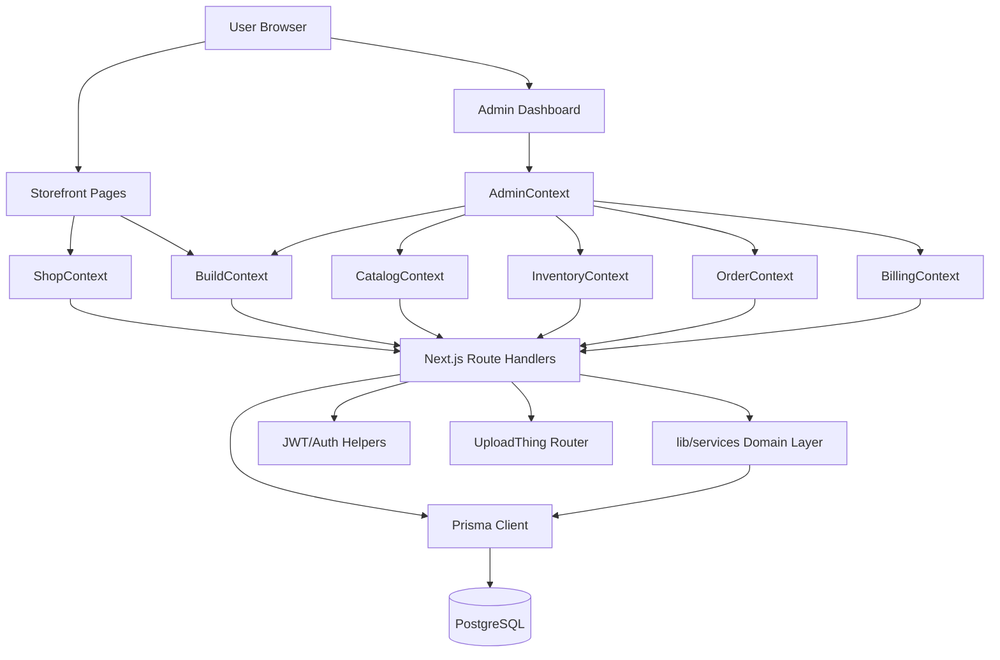
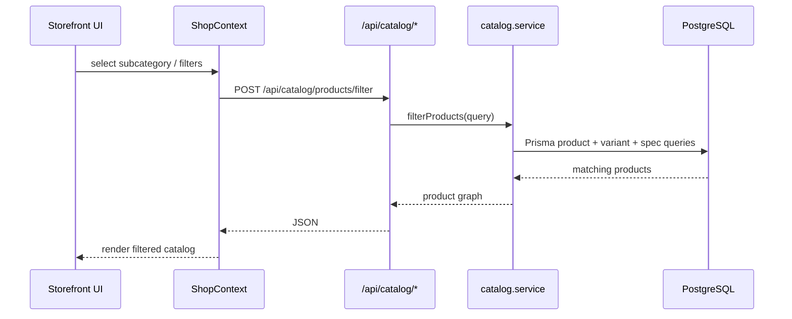
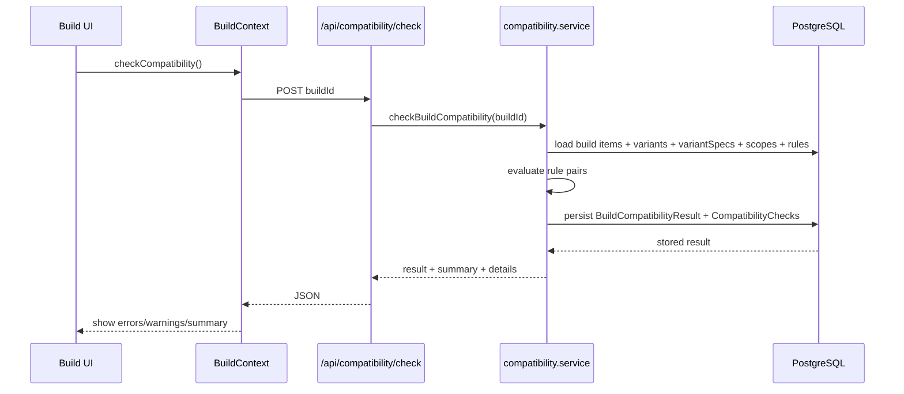
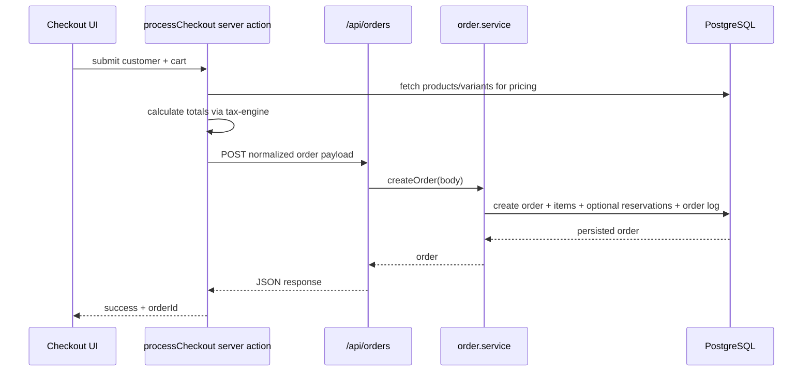

# MD Computers Architecture

## Overview

MD Computers is a single Next.js 16 application that combines:

- a customer storefront
- an authenticated admin dashboard
- a large internal API surface implemented with App Router route handlers
- a PostgreSQL database accessed through Prisma
- shared business logic for catalog, builds, compatibility, orders, inventory, billing, and auth

At a high level, this is a modular monolith:

- presentation and API live in one deployable app
- domain logic is split into server-side services under `lib/services/`
- client-side state and orchestration live in React contexts under `context/`
- persistence is centralized in Prisma models and the generated client

## Top-Level Structure

```text
app/
  (app)/                 storefront pages
  (auth)/                login/register pages
  admin/                 admin shell and dashboard tabs
  api/                   domain APIs
  actions/               server actions such as checkout

components/
  storefront/            customer-facing sections
  dashboard/             admin dashboard modules
  compatibility/         compatibility UI
  invoices/, orders/     domain-specific UI
  ui/                    shared primitives

context/
  ShopContext            storefront catalog + cart
  BuildContext           build + compatibility state
  CatalogContext         admin catalog state
  InventoryContext       admin inventory state
  OrderContext           admin order state
  BillingContext         admin billing state
  AdminContext           composed admin facade

lib/
  prisma.ts              Prisma client + pg pool
  jwt.ts                 JWT sign/verify
  tax-engine.ts          checkout financial calculations
  invoice*.tsx           invoice rendering/PDF
  services/              server-side business services

services/
  client-side fetch wrappers and helper utilities

prisma/
  schema.prisma          core data model

generated/prisma/
  generated Prisma client
```

## Runtime Architecture



## Layers

### 1. Presentation Layer

The UI is split into two major surfaces:

- Storefront: implemented in `app/(app)` with lazy-loaded landing sections, product listing/detail pages, checkout, orders, compare, and build flows.
- Admin: implemented in `app/admin` as a tabbed shell with lazy-loaded managers for orders, products, inventory, categories, brands, builds, billing, and marketing.

Notable characteristics:

- Root layout wraps the app in `ShopProvider` and `BuildProvider`.
- Admin uses a second composition layer through `AdminProvider`.
- UploadThing SSR config is installed globally in `app/layout.tsx`.
- `/admin/*` routes are protected by cookie-based JWT middleware.

### 2. Client State Layer

React contexts are the main client orchestration mechanism.

#### Storefront contexts

- `ShopContext`
  - loads categories, subcategories, brands, and specs
  - fetches filtered products from `/api/catalog/products/filter`
  - owns cart state and cart total
- `BuildContext`
  - creates/loads builds
  - adds/removes build items
  - triggers compatibility checks through `/api/compatibility/check`
  - derives overall compatibility status

#### Admin contexts

- `CatalogContext`
  - CRUD for products, variants, specs, categories, brands
- `InventoryContext`
  - inventory items and reservations
- `OrderContext`
  - order list/detail, status transitions, cancellation
- `BillingContext`
  - invoices, customers, billing profile
- `AdminContext`
  - composes the domain contexts and exposes an admin-wide `syncData()`

### 3. API Layer

The API surface lives under `app/api` and is grouped by domain:

- `auth/*`
- `catalog/*`
- `builds/*`
- `build-guides/*`
- `compatibility/*`
- `orders/*`
- `inventory/*`
- `billing/*`
- `customers/*`
- `system/audit`
- `uploadthing`

The common pattern is:

1. route handler parses request input
2. route delegates to `lib/services/*`
3. service talks to Prisma
4. route maps `ServiceError` to HTTP status codes

### 4. Domain Service Layer

The main server-side domain logic lives in `lib/services/`.

Core modules:

- `catalog.service.ts`
  - categories, subcategories, brands, specs, products, variants, filtering
- `build.service.ts` and `build-guide.service.ts`
  - build CRUD and saved build guides
- `compatibility.service.ts`
  - scope/rule management and build compatibility evaluation
- `order.service.ts`
  - order creation, optimistic updates, transition validation, side effects
- `inventory.service.ts`
  - inventory item CRUD, bulk stock adjustments, reservations
- `billing.service.ts`
  - invoice lifecycle, payments, credit notes, billing profile
- `auth.service.ts`, `customer.service.ts`
  - auth/customer support functions

There is also a second `services/` directory. That one is mostly client-side wrappers and utilities, not the authoritative business layer.

### 5. Persistence Layer

Persistence is centered on Prisma with PostgreSQL:

- `lib/prisma.ts` creates a pooled `pg` connection via `@prisma/adapter-pg`
- dev mode logs slow queries over 200ms
- production uses SSL and a lower pool size
- Prisma client is generated into `generated/prisma/`

## Core Domain Model

The schema is broad but organized around a few major aggregates.

### Catalog

```text
Category
  -> SubCategory
    -> SpecDefinition
      -> SpecOption
    -> Product
      -> ProductVariant
        -> VariantSpec
      -> ProductMedia
Brand -> Product
CategoryHierarchy -> navigation tree
```

This is the backbone for storefront listing, filtering, and compatibility.

### Build + Compatibility

```text
PartSlot <- SubCategorySlot -> SubCategory
Build -> BuildItem -> ProductVariant
CompatibilityScope(sourceSubCategory, targetSubCategory)
  -> CompatibilityRule(sourceSpec, targetSpec)
BuildCompatibilityResult -> CompatibilityCheck
```

Compatibility rules are spec-driven, not hardcoded by component type.

### Orders + Inventory

```text
Order -> OrderItem -> ProductVariant
Order -> OrderLog
Order -> ShipmentTracking
Order -> PaymentTransaction
Order -> Reservation -> InventoryItem
InventoryItem -> ProductVariant
```

Reservations bridge order intent and physical inventory availability.

### Billing

```text
Customer -> Order
Customer -> Invoice
Invoice -> InvoiceLineItem
Invoice -> InvoiceAuditEvent
InvoiceSequence -> invoice numbering
BillingProfile -> seller/company identity
```

## Key Request Flows

### 1. Storefront Product Discovery



### 2. Custom Build Compatibility Check



### 3. Checkout to Order Creation



### 4. Order Status Transitions

`order.service.ts` enforces a strict status DAG:

- `PENDING -> PAID -> PROCESSING -> SHIPPED -> DELIVERED`
- cancellation is allowed from pre-terminal states
- return is allowed after shipment/delivery

Side effects include:

- converting or releasing reservations
- adjusting `quantityOnHand` and `quantityReserved`
- marking inventory as sold or returned
- writing order logs

### 5. Invoice Lifecycle

`billing.service.ts` enforces invoice transitions:

- `DRAFT -> PENDING -> PAID / OVERDUE`
- terminal states: `VOIDED`, `CANCELLED`, `REFUNDED`

Additional behaviors:

- automatic invoice numbering via `InvoiceSequence`
- partial payment support with `amountPaid` and `amountDue`
- credit note creation against paid invoices
- audit event emission for every major action

## Authentication and Access Control

Auth is JWT-cookie based:

- login route validates credentials against `User`
- token is signed with `lib/jwt.ts`
- token is stored as an HTTP-only cookie named `token`
- `middleware.ts` protects `/admin/:path*`
- UploadThing also checks the same cookie before accepting uploads

## External Integrations

- PostgreSQL through Prisma and `pg`
- UploadThing for image uploads
- `@react-pdf/renderer` for invoice PDFs
- Nodemailer is available for email-related workflows

## Architectural Strengths

- clear modular-monolith shape with domain-oriented APIs
- rich Prisma schema that captures catalog, builds, inventory, orders, and billing in one place
- good separation between route handlers and server-side business services
- admin state is decomposed into domain contexts instead of one giant store
- compatibility engine is data-driven through specs, scopes, and rules

## Architectural Risks and Inconsistencies

These are the most important things to know from the code analysis:

- There are two service layers: `lib/services/` is the real server-side domain layer, while `services/` contains mostly client fetch wrappers and helpers. The naming overlap can confuse contributors.
- The checkout server action posts back into the app’s own `/api/orders` endpoint instead of calling the domain service directly. That works, but it adds an internal HTTP hop and duplicates some orchestration.
- Order/inventory reservation behavior is split between `order.service.ts` and standalone inventory helpers, and some flows appear to model reservation conversion differently. That makes inventory side effects harder to reason about globally.
- The root layout imports `Navbar` and `Footer`, but the rendered tree currently relies more on page-level layout composition than the root shell.
- Some storefront code still references legacy route imports like `@/app/api/products/route`, while the current API surface is centered on `app/api/catalog/*`. That suggests the project is mid-migration in parts of the catalog flow.

## Recommended Mental Model

When working in this repo, the safest mental model is:

1. Treat the app as one modular monolith.
2. Treat `app/api/*` as the public boundary between UI and server logic.
3. Treat `lib/services/*` as the source of truth for domain behavior.
4. Treat Prisma models as the canonical contract between domains.
5. Expect storefront and admin to share data models, but not necessarily the same client orchestration patterns.

## Suggested Next Refactors

- Consolidate service naming so `services/` and `lib/services/` have clearly different responsibilities.
- Move server actions that call internal APIs to direct domain-service calls where possible.
- Centralize inventory reservation/confirmation/release logic behind one authoritative service boundary.
- Standardize storefront catalog data access on `app/api/catalog/*` only.
- Add a short ADR or README per domain module for catalog, orders, inventory, billing, and compatibility.
