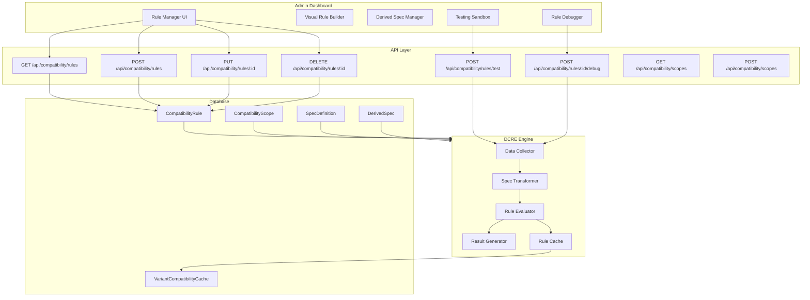

# Dynamic Compatibility Rule Engine (DCRE) — Complete Architecture

## 1. System Design



## 2. Prisma Schema Changes

The existing `CompatibilityRule` model is extended (not replaced) with new fields for dynamic logic support:

```prisma
// NEW ENUM
enum RuleType {
  PAIR       // Source spec vs Target spec (existing behavior)
  COMPONENT  // Single component constraints
  GLOBAL     // Full-build constraints (e.g., total TDP)
}

// EXTENDED MODEL — all new fields are optional with defaults,
// so existing rules continue to work unchanged
model CompatibilityRule {
  // ... existing fields preserved ...
  
  // NEW: Rule classification
  type            RuleType @default(PAIR)
  
  // NEW: JSON-based logic for COMPONENT/GLOBAL rules
  // Stores structured conditions that the engine evaluates
  logic           Json?
  
  // NEW: Message template with variable interpolation
  // e.g. "CPU {source.name} ({source.TDP}W) exceeds PSU limit ({target.Wattage}W)"
  messageTemplate String?
  
  // NEW: Execution ordering
  priority        Int      @default(0)
  
  // NEW: Toggle rules without deletion
  enabled         Boolean  @default(true)
  
  // NEW: Human-readable description for admin UI
  description     String?
}
```

> [!IMPORTANT]
> All new fields have defaults. Existing PAIR rules work without migration beyond adding columns.
> `sourceSpecId` and `targetSpecId` remain required for PAIR rules but become nullable for GLOBAL rules.

## 3. Data Flow

```
Admin Creates Rule via Visual Builder
    ↓
Rule saved to DB (CompatibilityRule)
    ↓
Build Compatibility Check Triggered
    ↓
1. Data Collector: Load build items + variant specs
    ↓
2. Spec Transformer: Compute derived specs (Total_TDP, etc.)
    ↓
3. Rule Evaluator: Load rules by scope → evaluate logic
    ↓
4. Result Generator: Format messages, produce report
    ↓
Compatibility Report returned to UI
```

## 4. Component Architecture

| Component | File | Responsibility |
|-----------|------|----------------|
| `CompatibilityManager` | `components/dashboard/CompatibilityManager.tsx` | Main container with tabs |
| `RuleList` | Inline section | Searchable, filterable rule list with enable/disable |
| `RuleEditor` | Modal/Panel | Visual rule builder with condition groups |
| `ConditionBuilder` | Inline component | AND/OR condition group builder |
| `DerivedSpecManager` | Tab panel | Formula builder for computed specs |
| `RuleSandbox` | Tab panel | Component picker + rule test execution |
| `RuleDebugger` | Inline in sandbox | Step-by-step evaluation trace |

## 5. API Structure

| Method | Path | Description |
|--------|------|-------------|
| `GET` | `/api/compatibility/rules` | List all rules with scope/spec includes |
| `POST` | `/api/compatibility/rules` | Create rule (validates scope ownership) |
| `PUT` | `/api/compatibility/rules/:id` | Update rule fields |
| `DELETE` | `/api/compatibility/rules/:id` | Soft-delete or hard-delete rule |
| `POST` | `/api/compatibility/rules/test` | Dry-run rules against mock build |
| `POST` | `/api/compatibility/rules/:id/debug` | Debug single rule with trace |
| `GET` | `/api/compatibility/scopes` | List all scopes |
| `POST` | `/api/compatibility/scopes` | Create/upsert scope |

## 6. Example Rules

### PAIR Rule: Socket Match
```json
{
  "name": "CPU-Motherboard Socket Match",
  "type": "PAIR",
  "scopeId": "<cpu-mb-scope-id>",
  "sourceSpecId": "<cpu-socket-spec-id>",
  "targetSpecId": "<mb-socket-spec-id>",
  "operator": "EQUAL",
  "severity": "ERROR",
  "message": "CPU socket {source.Socket} does not match motherboard socket {target.Socket}",
  "priority": 100,
  "enabled": true
}
```

### GLOBAL Rule: PSU Wattage Check
```json
{
  "name": "PSU Wattage Sufficient",
  "type": "GLOBAL",
  "logic": {
    "operator": "GREATER_OR_EQUAL",
    "left": { "ref": "PSU.Wattage" },
    "right": { "ref": "totals.totalTDP", "offset": 100 }
  },
  "messageTemplate": "Total system TDP ({totals.totalTDP}W + 100W headroom) exceeds PSU capacity ({PSU.Wattage}W)",
  "severity": "ERROR",
  "priority": 90
}
```

## 7. Example Test Case

**Input**: Select i9-14900K (TDP=253W) + RTX 4090 (TDP=450W) + 650W PSU

**Expected Output**:
```json
{
  "status": "INCOMPATIBLE",
  "issues": [
    {
      "ruleName": "PSU Wattage Sufficient",
      "severity": "ERROR",
      "message": "Total system TDP (803W + 100W headroom) exceeds PSU capacity (650W)",
      "trace": {
        "totalTDP": 803,
        "psuWattage": 650,
        "required": 903,
        "result": "FAIL"
      }
    }
  ]
}
```

## 8. Edge Cases

1. **Missing Specs**: Rule references a spec not present on the variant → treated as `undefined`, rule skips with INFO message
2. **Circular Dependencies**: Derived spec A references B which references A → detected at save time, rejected
3. **Empty Build**: < 2 items → skip PAIR rules, still run COMPONENT rules
4. **Disabled Rules**: Never loaded into evaluator, but visible in admin UI
5. **Duplicate Scopes**: Upsert prevents duplicate source+target combinations
6. **Null Operator**: GLOBAL rules don't use the `operator` field — they use `logic` JSON instead

## 9. Performance Considerations

1. **Rule Caching**: Rules loaded once per build check, indexed by `scopeId` in a Map
2. **Batch Scope Loading**: Single query with `IN` clause for all subcategory IDs in build
3. **VariantCompatibilityCache**: Pre-computed pair results, invalidated on rule change
4. **Derived Spec Memoization**: Computed once per build context, shared across all rules
5. **Priority-based Short Circuit**: If an ERROR rule fails, optionally skip lower-priority rules in same scope
6. **Pagination**: Rule list API supports `cursor` + `limit` for 1000+ rules
